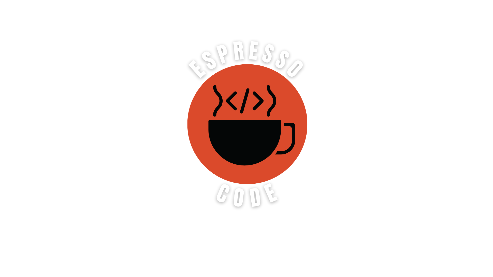

# Heey 👋

### I'm Jackson Arceno, a passionate backend developer from Brazil 

- 🔭 I’m currently working on Seventh
- 👨🏼‍🏫 I'm starting teach at Imagine School
- 🌱 I’m currently learning **about teaching programming basics**
- ▶️ I've a YouTube channel at [@espresso_code](https://www.youtube.com/@espresso_code)

##

### Connect with me

##

### Daily technologies

##

### I'm learning

And also to teach...

##

### Stats
<picture>
  <source
    media="(prefers-color-scheme: dark)"
    srcset="https://raw.githubusercontent.com/platane/snk/output/github-contribution-grid-snake-dark.svg"
  />
  <source
    media="(prefers-color-scheme: light)"
    srcset="https://raw.githubusercontent.com/platane/snk/output/github-contribution-grid-snake.svg"
  />
  
</picture>

  

  

  

